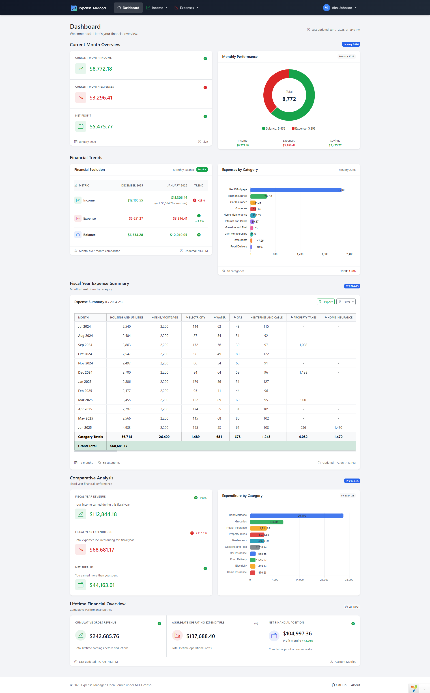
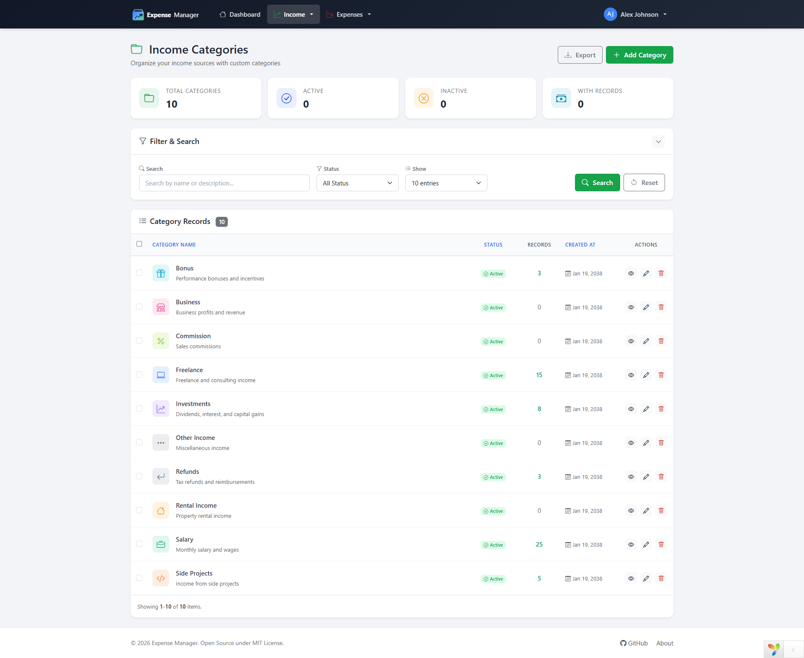
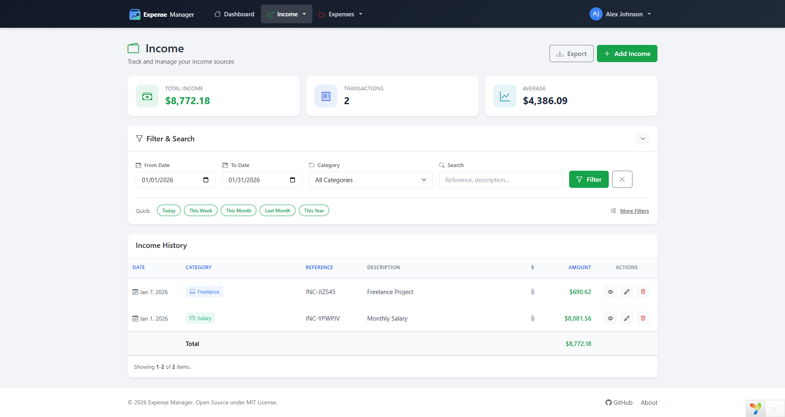
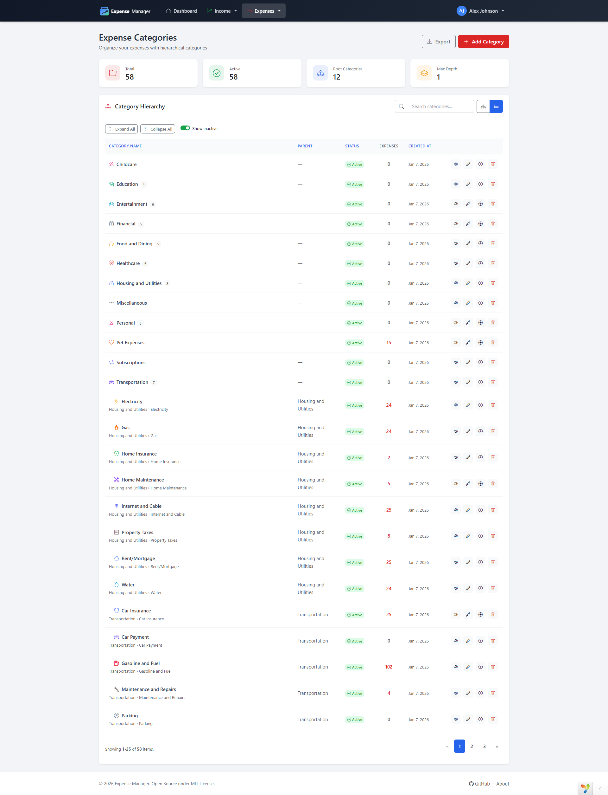
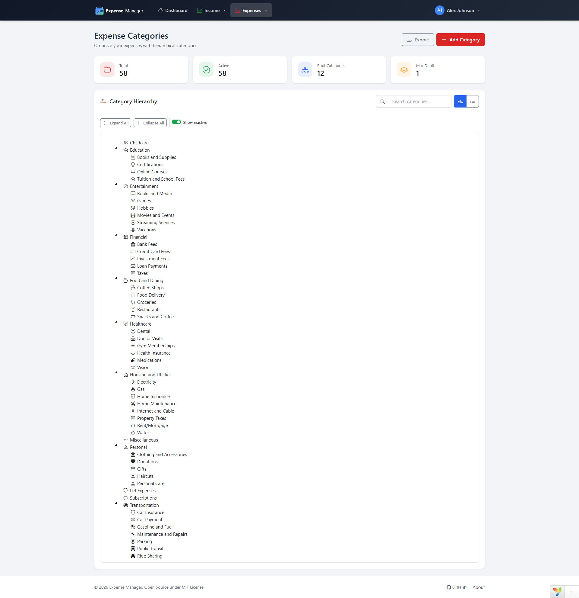
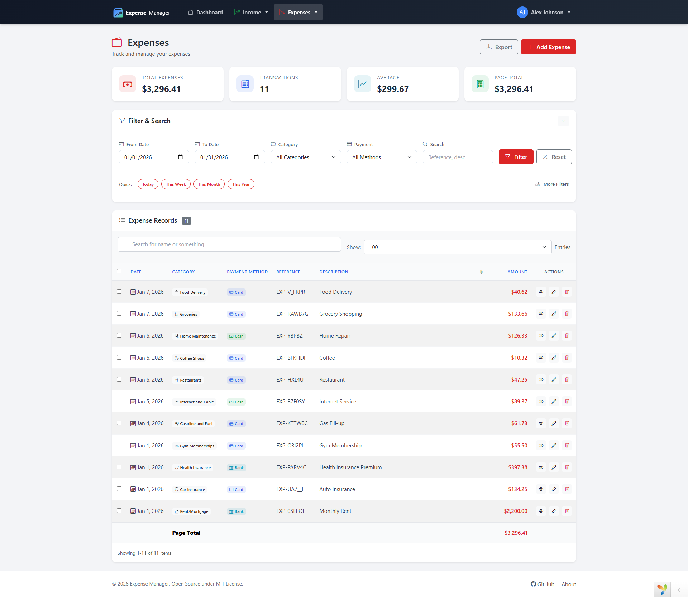
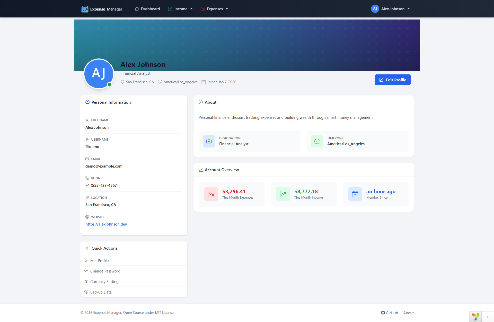

<p align="center">
  
</p>

<h1 align="center">Expense Manager</h1>

<p align="center">
  <strong>A modern, open-source personal finance management application built with Yii2</strong>
</p>

<p align="center">
  <a href="https://github.com/mohsin-rafique/expense-manager/releases">
    
  </a>
  <a href="https://github.com/mohsin-rafique/expense-manager/blob/main/LICENSE">
    
  </a>
  <a href="https://github.com/mohsin-rafique/expense-manager/stargazers">
    
  </a>
  <a href="https://github.com/mohsin-rafique/expense-manager/issues">
    
  </a>
  
  
  
</p>

<p align="center">
  <a href="#features">Features</a> •
  <a href="#screenshots">Screenshots</a> •
  <a href="#installation">Installation</a> •
  <a href="#configuration">Configuration</a> •
  <a href="#usage">Usage</a> •
  <a href="#contributing">Contributing</a> •
  <a href="#support">Support</a> •
  <a href="#license">License</a>
</p>

---

## Overview

**Expense Manager** is a free, open-source personal finance application designed to help individuals and small businesses track income and expenses, organize transactions into categories, and gain meaningful insights into their financial activities.

Built on the robust **Yii2 PHP framework** with **Bootstrap 5**, it offers a clean, modern interface with powerful features — all while remaining lightweight and easy to self-host.

### Why Expense Manager?

-   🆓 **100% Free & Open Source** — No hidden costs, no subscriptions
-   🔒 **Self-Hosted** — Your financial data stays on your server
-   🚀 **Lightweight** — Runs on minimal server resources
-   🎨 **Modern UI** — Clean Bootstrap 5 design with dark/light themes
-   📱 **Responsive** — Works on desktop, tablet, and mobile

---

## Features

### 💰 Income Management

-   Record and track all income sources
-   Categorize income with custom categories
-   Attach receipts and invoices (PDF, images)
-   Search and filter by date, category, reference
-   Export income data to Excel

### 💸 Expense Management

-   Track expenses with detailed information
-   Hierarchical expense categories (parent/child)
-   Multiple payment methods (Cash, Card, Bank)
-   File attachments for receipts
-   Advanced filtering and search
-   Export expense data to Excel

### 📊 Dashboard & Reports

-   Financial overview dashboard
-   Income vs Expense summary cards
-   Monthly/yearly statistics
-   Category-wise breakdown
-   Visual charts and graphs
-   Balance tracking

### 👤 User Management

-   Secure authentication system
-   User profile management
-   Password reset functionality
-   Remember me option
-   Session management

### ⚙️ Settings & Customization

-   Multi-currency support (50+ currencies)
-   Customizable currency formatting
-   Date and time format preferences
-   Company/business branding
-   Logo and favicon upload
-   Timezone configuration

### 🎨 Modern UI/UX

-   Clean, responsive Bootstrap 5 design
-   Dark/Light theme toggle
-   Mobile-friendly interface
-   AJAX-powered interactions (PJAX)
-   Toast notifications
-   Modal-based forms

---

## Screenshots

<p align="center">
  
  <br><em>Dashboard — Financial overview at a glance</em>
</p>

<p align="center">
  
  <br><em>Income Categories — Organize your income sources</em>
</p>

<p align="center">
  
  <br><em>Income — Track all your earnings</em>
</p>

<p align="center">
  
  <br><em>Expense Categories — Grid view</em>
</p>

<p align="center">
  
  <br><em>Expense Categories — Hierarchical tree view</em>
</p>

<p align="center">
  
  <br><em>Expenses — Detailed expense tracking</em>
</p>

<p align="center">
  
  <br><em>Profile — User settings and preferences</em>
</p>

---

## Requirements

| Requirement     | Version        |
| --------------- | -------------- |
| PHP             | 8.1 or higher  |
| MySQL / MariaDB | 5.7+ / 10.3+   |
| Composer        | 2.x            |
| Web Server      | Apache / Nginx |

### PHP Extensions Required

-   `pdo_mysql`
-   `mbstring`
-   `intl`
-   `gd` or `imagick`
-   `json`
-   `openssl`

---

## Installation

### Option 1: Install via Composer (Recommended)

```bash
# Create project
composer create-project mohsin-rafique/expense-manager expense-manager

# Navigate to project
cd expense-manager

# Install dependencies
composer install

# Set permissions
chmod -R 777 runtime web/assets web/uploads
```

### Option 2: Install from GitHub

```bash
# Clone repository
git clone https://github.com/mohsin-rafique/expense-manager.git

# Navigate to project
cd expense-manager

# Install dependencies
composer install

# Set permissions
chmod -R 777 runtime web/assets web/uploads
```

### Option 3: Download ZIP

1. Download from [GitHub Releases](https://github.com/mohsin-rafique/expense-manager/releases)
2. Extract to your web root
3. Run `composer install`
4. Set directory permissions

---

## Configuration

### 1. Database Setup

Create a new MySQL database:

```sql
CREATE DATABASE expense_manager CHARACTER SET utf8mb4 COLLATE utf8mb4_unicode_ci;
```

Configure database connection:

```bash
# Copy example config file
cp config/db.example.php config/db.php
```

Edit `config/db.php` with your database credentials:

```php
return [
    'class' => 'yii\db\Connection',
    'dsn' => 'mysql:host=localhost;dbname=expense_manager',
    'username' => 'your_username',
    'password' => 'your_password',
    'charset' => 'utf8mb4',
];
```

### 2. Run Migrations

```bash
# Run all migrations
php yii migrate

# This creates all required tables:
# - user
# - profile
# - settings
# - income_categories
# - incomes
# - expense_categories
# - expenses
```

### 3. Configure Application

Update `config/web.php` with a unique cookie validation key:

```php
'request' => [
    'cookieValidationKey' => 'your-unique-random-string-here',
],
```

### 4. Web Server Configuration

#### Apache (.htaccess)

The `.htaccess` file is included in the `web/` directory. Ensure `mod_rewrite` is enabled:

```bash
sudo a2enmod rewrite
sudo systemctl restart apache2
```

#### Nginx

```nginx
server {
    listen 80;
    server_name your-domain.com;
    root /path/to/expense-manager/web;
    index index.php;

    location / {
        try_files $uri $uri/ /index.php?$args;
    }

    location ~ \.php$ {
        include fastcgi_params;
        fastcgi_param SCRIPT_FILENAME $document_root$fastcgi_script_name;
        fastcgi_pass unix:/var/run/php/php8.1-fpm.sock;
    }

    location ~ /\.(ht|git) {
        deny all;
    }
}
```

---

## Usage

### Getting Started

1. **Access the application**: Navigate to `http://your-domain.com` or `http://localhost/expense-manager/web/`

2. **Register an account**: Create your first user account

3. **Configure settings**: Set up your currency, timezone, and company details

4. **Create categories**: Add income and expense categories

5. **Start tracking**: Record your income and expenses

### Managing Income

1. Navigate to **Income → All Income**
2. Click **Add Income** to create a new record
3. Fill in the details:
    - Select date
    - Choose category
    - Enter amount
    - Add reference/description (optional)
    - Attach receipt (optional)
4. Use filters to search and organize records
5. Export to Excel for external reporting

### Managing Expenses

1. Navigate to **Expenses → All Expenses**
2. Click **Add Expense** to create a new record
3. Fill in the details:
    - Select date
    - Choose category
    - Enter amount
    - Select payment method (Cash/Card/Bank)
    - Add reference/description (optional)
    - Attach receipt (optional)
4. Use filters to search and organize records
5. Export to Excel for external reporting

### Managing Categories

**Income Categories:**

-   Navigate to **Income → Categories**
-   Add, edit, or delete categories
-   Customize with icons and colors

**Expense Categories:**

-   Navigate to **Expenses → Categories**
-   Supports hierarchical structure (parent/child)
-   Drag-and-drop organization
-   Customize with icons and colors

### Dashboard & Reports

-   **Dashboard**: Overview of financial status with summary cards
-   **Reports**: Detailed financial reports with charts
-   **Widgets**: Quick stats for income, expenses, and balance

---

## Project Structure

```
expense-manager/
├── assets/                 # Asset bundles
├── commands/               # Console commands
├── components/             # Application components
│   ├── BalanceHelper.php
│   ├── CurrencyFormatter.php
│   └── ...
├── config/                 # Configuration files
│   ├── db.php
│   ├── params.php
│   └── web.php
├── controllers/            # Web controllers
│   ├── ExpenseController.php
│   ├── IncomeController.php
│   └── ...
├── migrations/             # Database migrations
├── models/                 # ActiveRecord models
│   ├── Expense.php
│   ├── Income.php
│   └── ...
├── runtime/                # Runtime files (logs, cache)
├── views/                  # View templates
│   ├── expenses/
│   ├── incomes/
│   ├── layouts/
│   └── ...
├── web/                    # Web root
│   ├── css/
│   ├── js/
│   ├── uploads/
│   └── index.php
├── widgets/                # Custom widgets
├── composer.json
├── LICENSE
└── README.md
```

---

## Development

### Code Style

This project follows [Yii2 Coding Standards](https://github.com/yiisoft/yii2-coding-standards):

```bash
# Install Yii2 coding standards
composer require --dev yiisoft/yii2-coding-standards

# Check code style
php vendor/bin/phpcs --standard=Yii2 controllers models components widgets

# Fix code style
php vendor/bin/phpcbf --standard=Yii2 controllers models components widgets
```

### Debug Mode

Enable debug mode in `web/index.php` for development:

```php
defined('YII_DEBUG') or define('YII_DEBUG', true);
defined('YII_ENV') or define('YII_ENV', 'dev');
```

---

## Contributing

Contributions are welcome and greatly appreciated!

### How to Contribute

1. **Fork** the repository
2. **Clone** your fork: `git clone https://github.com/YOUR-USERNAME/expense-manager.git`
3. **Create** a feature branch: `git checkout -b feature/amazing-feature`
4. **Commit** your changes: `git commit -m 'Add amazing feature'`
5. **Push** to branch: `git push origin feature/amazing-feature`
6. **Open** a Pull Request

### Contribution Guidelines

-   Follow [Yii2 coding standards](https://github.com/yiisoft/yii2-coding-standards)
-   Write meaningful commit messages
-   Update documentation as needed
-   Be respectful in discussions

### Reporting Issues

Found a bug? Please [open an issue](https://github.com/mohsin-rafique/expense-manager/issues/new) with:

-   Clear description of the problem
-   Steps to reproduce
-   Expected vs actual behavior
-   Screenshots (if applicable)
-   Environment details (PHP version, OS, etc.)

---

## Support

If this project helps you, consider supporting its development:

<p align="center">
  <a href="https://wise.com/pay/me/mohsinr301">
    
  </a>
</p>

### Other Ways to Support

-   ⭐ **Star** this repository
-   🐛 **Report bugs** and suggest features
-   📖 **Improve documentation**
-   📢 **Share** with others who might find it useful

---

## Roadmap

-   [ ] Multi-language support (i18n)
-   [ ] Data import from CSV/Excel
-   [ ] Advanced reporting with PDF export
-   [ ] Budget management module
-   [ ] Multi-user/team support
-   [ ] API Development (Yii2 REST)
-   [ ] Mobile app (React Native)

---

## License

This project is open-source software licensed under the [MIT License](LICENSE).

```
MIT License

Copyright (c) 2025 Mohsin Rafique

Permission is hereby granted, free of charge, to any person obtaining a copy
of this software and associated documentation files (the "Software"), to deal
in the Software without restriction, including without limitation the rights
to use, copy, modify, merge, publish, distribute, sublicense, and/or sell
copies of the Software, and to permit persons to whom the Software is
furnished to do so, subject to the following conditions:

The above copyright notice and this permission notice shall be included in all
copies or substantial portions of the Software.
```

---

## Acknowledgments

-   [Yii Framework](https://www.yiiframework.com/) — The fast, secure, and professional PHP framework
-   [Bootstrap](https://getbootstrap.com/) — The world's most popular front-end toolkit
-   [Bootstrap Icons](https://icons.getbootstrap.com/) — Free, high-quality icons
-   All [contributors](https://github.com/mohsin-rafique/expense-manager/graphs/contributors) who help improve this project

---

## Author

<p align="center">
  <a href="https://github.com/mohsin-rafique">
    
  </a>
</p>

<p align="center">
  <strong>Mohsin Rafique</strong><br>
  Full Stack Developer
</p>

<p align="center">
  <a href="https://github.com/mohsin-rafique">GitHub</a> •
  <a href="https://mohsinrafique.com">Website</a> •
  <a href="mailto:mohsin.rafique@gmail.com">Email</a>
</p>

---

<p align="center">
  ⭐ Star this repository if you find it useful!
</p>

<p align="center">
  <a href="#expense-manager">Back to Top ↑</a>
</p>
